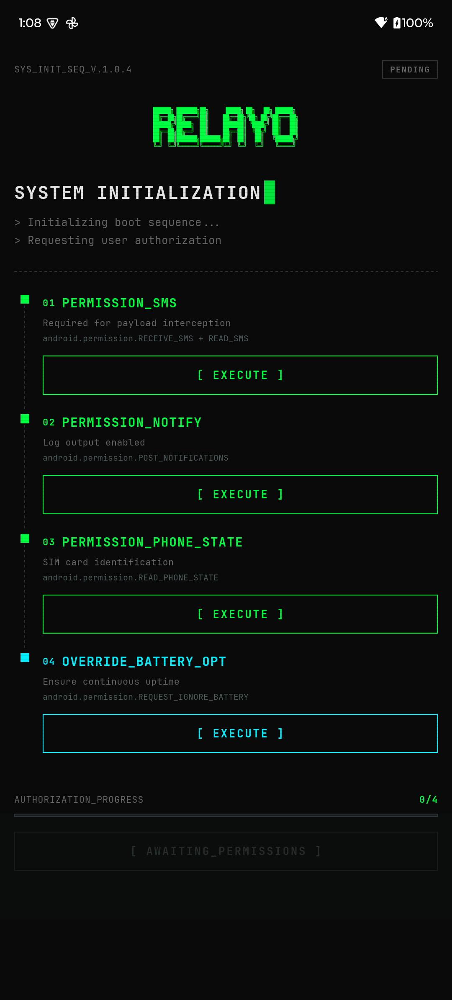
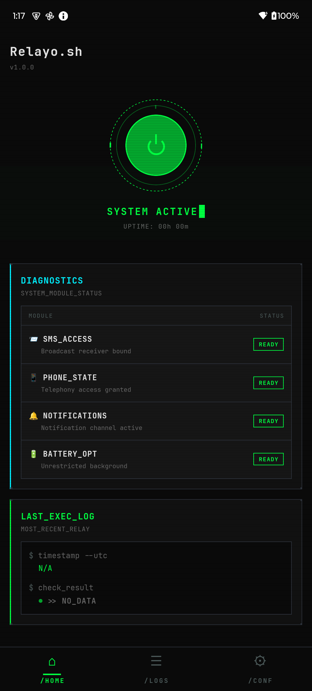
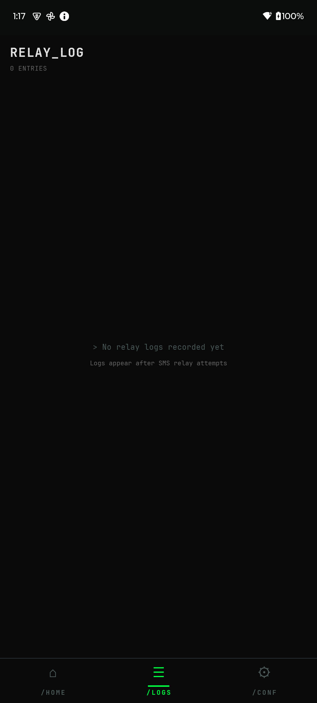
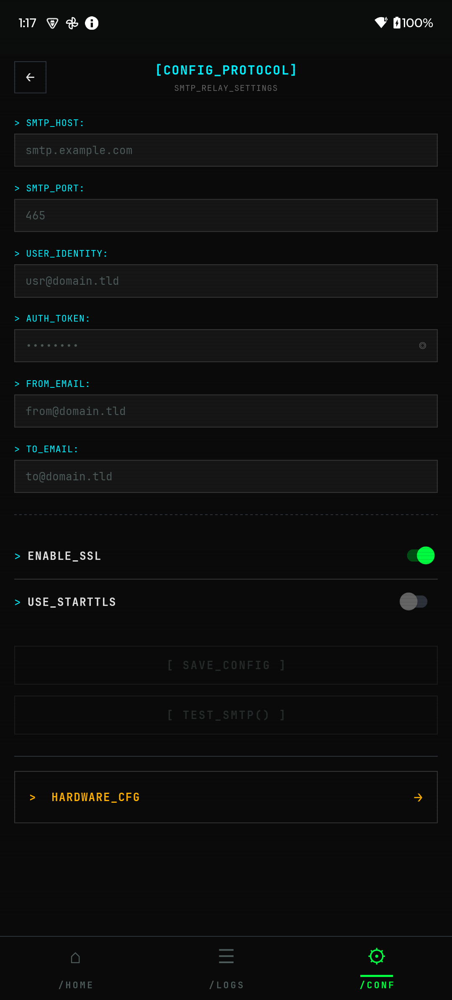

# Relayo

**SMS → Email forwarder for Android.** Runs silently in the background, catches every incoming SMS, and fires it to your inbox via SMTP. No cloud. No accounts. Just your phone and your mail server.

Built with React Native + Kotlin. Looks like a terminal because why not.

## Screenshots

<p align="center">
  
  
  
  
</p>

## How it works

```
SMS arrives → BroadcastReceiver catches it → SMTP sends email → Done
```

That's it. The app registers a high-priority SMS broadcast receiver, extracts the sender/body/SIM info, and pushes it through Jakarta Mail to whatever SMTP server you configure. Failed sends go into an outbox queue and retry automatically when connectivity returns.

## Features

- **Background relay** — Foreground service keeps it alive. Survives Doze, battery optimization, reboots
- **Dual SIM aware** — Knows which SIM received the SMS
- **Outbox queue** — Room/SQLite backed. Network drops don't lose messages
- **Relay logs** — Every attempt logged with status, timestamps, error details. Delete individual entries or nuke them all
- **SMTP test** — Verify your config sends successfully before going live
- **Zero cloud** — Direct SMTP. Your credentials stay in Android Keystore, encrypted on-device

## Setup

1. Install the APK from [Releases](https://github.com/addison-w/Relayo/releases)
2. Grant permissions (SMS, notifications, phone state, battery optimization)
3. Configure your SMTP server (host, port, credentials, SSL/STARTTLS)
4. Hit the power button. That's it

Works with Gmail (app passwords), Outlook, Fastmail, self-hosted — anything that speaks SMTP.

## Tech

| Layer | Stack |
|-------|-------|
| UI | React Native 0.84, TypeScript, React Navigation v7 |
| Native | Kotlin, TurboModules (New Architecture) |
| Storage | Room/SQLite (outbox + logs), Android Keystore (credentials) |
| SMTP | Jakarta Mail (`com.sun.mail:android-mail`) |
| Design | JetBrains Mono, dark theme, 0px border radius, terminal aesthetic |

## Building from source

```bash
# Prerequisites: Node.js, JDK 21, Android SDK

npm install
npx react-native run-android
```

## License

MIT
